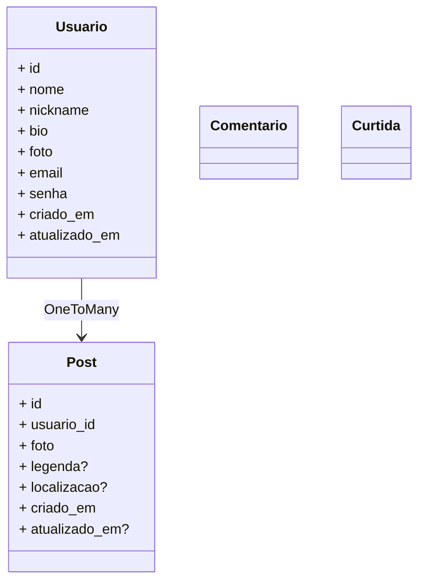

# api-instagram
app do instagram 

## Tecnologias 
- NodeJS
- ExpressJS
- MySQL 

### Recursos 
- Usuários 
- Posts
- Comentarios 
- Curtidas 

### Estruturas dos Dados 

```mermaid 
classDiagram
    Usuario --> Post: OneToMany
    
    class Usuario {
        + id
        + nome 
        + nickname
        + bio
        + foto 
        + email
        + senha 
        + criado_em
        + atualizado_em
    }

    class Post {
        + id
        + usuario_id
        + foto 
        + legenda?
        + localizacao?
        + criado_em
        + atualizado_em?
    }

    class Comentario {

    }

   class Curtida {

   }
```